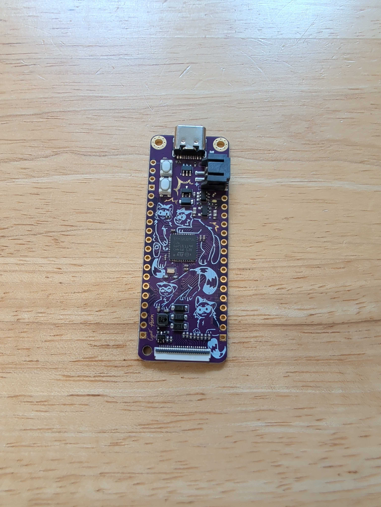

# stm32u0

Ultra low powered mcu devboard - 1+ year on a 500mAh lipo. With on board e-ink connector so you can get ultra long battery life with displays.

It works with all types of 24-pin E-ink screens. Programmed via stm32 utilities.

Has on-board battery charger and battery connector. Battery is also broken out via a pin. It is in feather form so compatible with all addons

Features:
- On-board e-ink connector
- Battery charging and decharging
- stm32u0 
- adafruit feather form
- Small form factor with mounting holes

The PCB and schematic is also open source, availiable for everyone to see and learn from.

| Item | Price | Where |
| ---- | ----- | ----- |
| PCB & PCBA | $100 | jlc |
